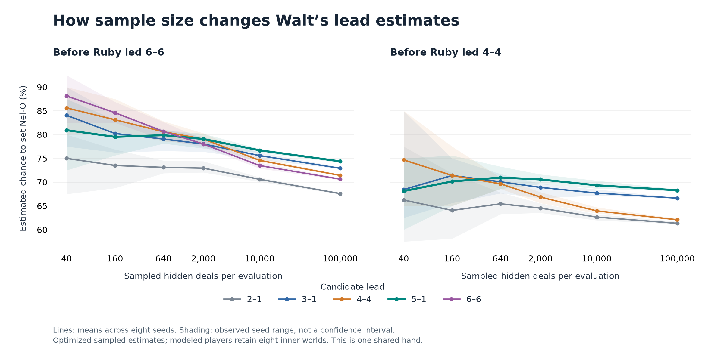

# Ruby double leads: the full sample ladder

EXPLORATORY. Same two own/public positions and seeds 1–8; same modeled response policy (eight inner worlds), fixed selection, and uniform legal-deal outer sampling. The outer sample budget changes; the 100,000-world local research build also receives a 240-second decision deadline so completed evaluations can finish.

At 100,000 worlds, all eight runs at both positions choose 5–1. At the first position it exceeds the played 6–6 by 3.575–3.967 percentage points in every run; at the second it exceeds the played 4–4 by 5.957–6.351 points. These are observed per-seed gaps, not confidence intervals.

[Vector figure](sampling-ladder.svg). Lines are eight-seed averages; shading is the observed seed range.

## Before Ruby led 6–6

Mean estimated eventual set probability across eight seeds.

| Outer worlds | 2–1 | 3–1 | 4–4 | 5–1 | 6–6 | Chosen moves |
|---:|---:|---:|---:|---:|---:|---|
| 40 | 75.00% | 84.06% | 85.62% | 80.94% | 88.12% | 3–1: 1/8, 4–4: 1/8, 5–1: 1/8, 6–6: 5/8 |
| 160 | 73.52% | 80.23% | 83.12% | 79.53% | 84.61% | 4–4: 3/8, 6–6: 5/8 |
| 640 | 73.11% | 79.06% | 80.61% | 79.88% | 80.66% | 3–1: 2/8, 4–4: 3/8, 5–1: 1/8, 6–6: 2/8 |
| 2000 | 72.95% | 78.04% | 79.07% | 79.07% | 78.03% | 3–1: 1/8, 4–4: 4/8, 5–1: 3/8 |
| 10000 | 70.60% | 75.59% | 74.58% | 76.70% | 73.49% | 5–1: 8/8 |
| 100000 | 67.60% | 72.92% | 71.43% | 74.38% | 70.64% | 5–1: 8/8 |

## Before Ruby led 4–4

Mean estimated eventual set probability across eight seeds.

| Outer worlds | 2–1 | 3–1 | 4–4 | 5–1 | Chosen moves |
|---:|---:|---:|---:|---:|---|
| 40 | 66.25% | 68.44% | 74.69% | 68.12% | 2–1: 1/8, 3–1: 2/8, 4–4: 4/8, 5–1: 1/8 |
| 160 | 64.06% | 71.41% | 71.41% | 70.16% | 3–1: 4/8, 4–4: 2/8, 5–1: 2/8 |
| 640 | 65.45% | 70.08% | 69.65% | 70.98% | 3–1: 2/8, 5–1: 6/8 |
| 2000 | 64.54% | 68.90% | 66.86% | 70.58% | 5–1: 8/8 |
| 10000 | 62.66% | 67.71% | 63.96% | 69.34% | 5–1: 8/8 |
| 100000 | 61.34% | 66.64% | 62.10% | 68.29% | 5–1: 8/8 |

## Interpretation

The early apparent double advantage reverses as the sample expands. This is consistent with optimistic continuation selection on small samples: Walt chooses its future actions on the same sampled deals used to report their values. Source inspection confirms that future viewer choices optimize over the surviving sampled information sets. More observed plays can divide a small sample into thin branches, allowing a plan to look more informed than it would under a much larger belief.

That mechanism remains a hypothesis for this episode: no frozen-plan holdout or branch-occupancy ablation has been run. More outer samples also do not improve the fixed eight-world modeled players or validate their behavior against a human declarer. The original choice/seed/receipt is still absent from the shared hand link.

The 10,000-to-100,000 shift preserves the chosen action in all sixteen cases, but mean values still fall; this is not a convergence proof. This one hand establishes sensitivity to sample budget here, not a general comparison of Nel-O and straight 42.

There is no newly demonstrated game-rule or contract-objective defect. The earlier full-information result remains distinct: all Ruby leads at these two actual deal positions allowed a forced set. The larger-sample hidden-information model nevertheless consistently prefers 5–1.

## Timing, memory and reproduction

At 100,000 worlds, sixteen timed WASM calls totaled 556.692 seconds (9 minutes 17 seconds). Mean per-call times were 63.240 seconds at the first position and 6.346 seconds at the second. Every case completed exactly 100,000 accepted worlds. Each ran in a fresh Node process under a 295-second outer watchdog and a 240-second internal decision deadline.

Peak WASM linear memory was 1,536,491,520 bytes (1.431 GiB), and peak observed process RSS was 1,606,860,800 bytes (1.497 GiB). This Mac has 48 GiB RAM; live memory pressure stayed healthy and swap remained unused. These are host measurements, not phone measurements. The previous 10,000-world calls totaled 81.704 seconds with mean times 8.755 and 1.458 seconds.

- [100,000-world report](100000/REPORT100000.md): current build/run provenance and raw results.
- [10,000-world report](10000/REPORT10000.md): previous complete larger-sample panel.
- [2,000-world report](2000/REPORT2000.md): earlier timing/feasibility comparison.
- [Double exposure](DOUBLE-EXPOSURE.md): exact discard-risk combinatorics and why 4–4 differs from 6–6.
- `compare-panels.py` regenerates `ladder-summary.json` using exact rational scores from completed panels/cases.
- `plot-ladder.py` renders the PNG and SVG from that summary (Python with Matplotlib; this render used Matplotlib 3.11.2).
- Sampling/optimization distinction: `walt/math/signed_pivotal_geometry_v0.1.md`, section 3; this result does not establish a frozen-plan confidence claim.
